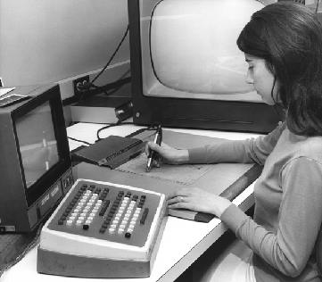
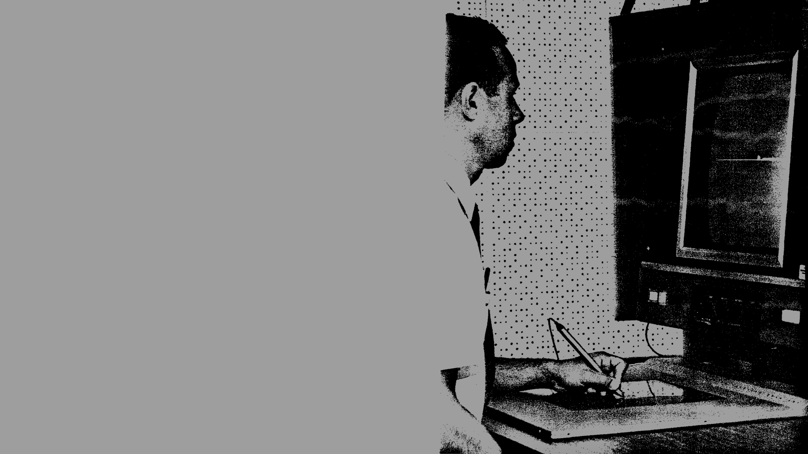
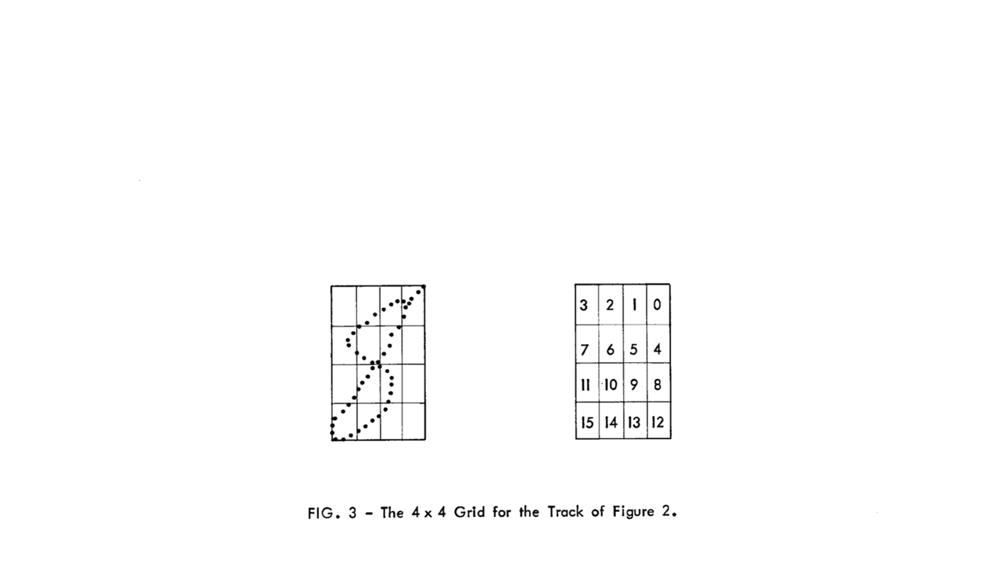

slidenumbers: true

^ footer: Hand Writing Recognition

^ ---



### **SQL is a Programming Language, Summer 2018**<br><br>

# [fit] Handwriting Recognition
## with SQL (and a tiny bit of web stuff)

<br>
<br>
<br>

Noah Doersing

---
<!--
## Handwriting *sucks* and we want to translate it into a format that doesn't suck (e.g. a  database)
---
-->

## *A long time ago in a galaxy very, very close...*

In the early 60s, keyboard proficiency was less widespread, so other input methods were explored.

^ You know, before their time, really, because they had these massive CRT screens etc., no iPad.

^ alan kay, pioneered object-oriented programming and window-based GUIs

  Alan Kay, "Doing with Images Makes Symbols" (1987):[^1]
     **"None of us can type, can you do something about that?"**

[^1]: `http://archive.org/details/AlanKeyD1987?start=1439.5`

---


---

[Instead of implementing an entire interface paradigm, only consider *core problem*: **Recognition of a single-stroke character.**]()

[Slight modifications to some characters to make this work.]()


---

^ The RAND tablet was $18K, which is slightly above my pay grade

^ mention origin in bottom left, not top left as is standard in computer graphics


Simple D3.js-based web version, connected
to a PostgreSQL instance running on my
server. **Try it on your phones:**

<br>

## `hejnoah.com/handwriting/`

---

The web version yields a *JSON array of coordinate pairs*. In order to transfer this into a  database...

**1.** Define variable `pen` via command-line parameter.

```bash
psql -v pen='[{"x":1, "y":3},{"x":3, "y":7}]' -f handwriting.sql                
```

**2.** Convert JSON array into tabular representation.

```sql
WITH RECURSIVE
tablet(pos, x, y) AS (
  SELECT ordinality AS pos, x, y
  FROM   ROWS FROM(jsonb_to_recordset(:'pen') AS (x int, y int)) WITH ORDINALITY
), ...
```

---



## Approach[^2]

1. Smoothing & thinning of stroke
2. Curvature & corner detection
3. Extraction of additional features
4. Descending a hardcoded *decision
   tree* mapping features to characters

[^2]: `https://www.rand.org/pubs/research_memoranda/RM5016.html`

---

**Smoothing:** Removes *quantization noise*. Compute weighted average of most recently smoothed point and incoming point.

# TODO video

---

Variable `smoothingfactor` must be set before running the query. Sensible values: between 0.5 and 0.8.

```sql
smooth(pos, x, y) AS (
  SELECT pos, x :: real, y :: real
  FROM   tablet
  WHERE  pos = 1

    UNION ALL

  SELECT t.pos,
         (:smoothingfactor * s.x + (1.0 - :smoothingfactor) * t.x) :: real AS x,
         (:smoothingfactor * s.y + (1.0 - :smoothingfactor) * t.y) :: real AS y
  FROM   smooth s, tablet t
  WHERE  t.pos = s.pos + 1
),
```

---

Variable `smoothingfactor` must be set before running the query. Sensible values: between 0.5 and 0.8.

```sql, [.highlight: 2-4]
smooth(pos, x, y) AS (
  SELECT pos, x :: real, y :: real
  FROM   tablet
  WHERE  pos = 1

    UNION ALL

  SELECT t.pos,
         (:smoothingfactor * s.x + (1.0 - :smoothingfactor) * t.x) :: real AS x,
         (:smoothingfactor * s.y + (1.0 - :smoothingfactor) * t.y) :: real AS y
  FROM   smooth s, tablet t
  WHERE  t.pos = s.pos + 1
),
```

---

Variable `smoothingfactor` must be set before running the query. Sensible values: between 0.5 and 0.8.

```sql, [.highlight: 8-12]
smooth(pos, x, y) AS (
  SELECT pos, x :: real, y :: real
  FROM   tablet
  WHERE  pos = 1

    UNION ALL

  SELECT t.pos,
         (:smoothingfactor * s.x + (1.0 - :smoothingfactor) * t.x) :: real AS x,
         (:smoothingfactor * s.y + (1.0 - :smoothingfactor) * t.y) :: real AS y
  FROM   smooth s, tablet t
  WHERE  t.pos = s.pos + 1
),
```

---

**Thinning:** Eases further *processing requirements*. Reject points within a certain distance from the most recent accepted point.

# TODO video

---

```sql
thin(pos, x, y) AS (
  SELECT *
  FROM   smooth
  WHERE  pos = 1

    UNION ALL

  SELECT *
  FROM   (
    SELECT s.pos, s.x, s.y
    FROM   thin t, smooth s
    WHERE  s.pos > t.pos
    AND    :thinningsize < |/ (s.x - t.x)^2 + (s.y - t.y)^2                     
    ORDER BY s.pos
    LIMIT 1
  ) AS _
),
```

---

```sql, [.highlight: 10-15]
thin(pos, x, y) AS (
  SELECT *
  FROM   smooth
  WHERE  pos = 1

    UNION ALL

  SELECT *
  FROM   (
    SELECT s.pos, s.x, s.y
    FROM   thin t, smooth s
    WHERE  s.pos > t.pos
    AND    :thinningsize < |/ (s.x - t.x)^2 + (s.y - t.y)^2                     
    ORDER BY s.pos
    LIMIT 1
  ) AS _
),
```

---

^ because order by is illegal in recursive part

```sql, [.highlight: 8,9,16]
thin(pos, x, y) AS (
  SELECT *
  FROM   smooth
  WHERE  pos = 1

    UNION ALL

  SELECT *
  FROM   (
    SELECT s.pos, s.x, s.y
    FROM   thin t, smooth s
    WHERE  s.pos > t.pos
    AND    :thinningsize < |/ (s.x - t.x)^2 + (s.y - t.y)^2                     
    ORDER BY s.pos
    LIMIT 1
  ) AS _
),
```

---

**Curvature detection:** Compute *cardinal directions* ▲▼◀▶ of line segments between point pairs. Discard sequential duplicates.

Originally done using a set of inequalities, but on modern hardware some trigonometry is less of a performance issue:<br>
 
$$\text{Let } p_1 = (x_1, y_1) \text{ and } p_2 = (x_2, y_2).$$
$$\text{Construct a right triangle with hypo-}$$
$$\text{tenuse } \overline{p_1p_2} \text{ and the two axes as legs.}$$
$$\text{The direction of the line } \overline{p_1p_2} \text{ then is}$$
$$\phantom{j^{j^{j^{j^{j^I}}}}}\alpha = \pi + \tan^{-1}\left(\frac{y_2 - y_1}{x_1 - x_2}\right).$$

---

**1.** Compute angle between every pair of thinned points using window function `lag()`:

```sql
curve(pos, x, y, direction) AS (
  SELECT pos, x, y,
         COALESCE(degrees(-atan2( y - lag(y) OVER (ORDER BY pos),               
                                 -x + lag(x) OVER (ORDER BY pos))
                         ) + 180,
                  90)
  FROM   thin
),
```

---

**2.** Define appropriate `ENUM` type with fancy Unicode triangles:

```sql
CREATE TYPE cardinal_direction AS ENUM('▶', '▲', '◀', '▼');                     
```

**3.** Use `enum_range()` function (returns the values of its argument's `ENUM` type as an array) to convert `angle / 90` into arrow symbols.

```sql
cardinal(pos, direction) AS (
  SELECT pos,
         (enum_range(NULL :: cardinal_direction))[(direction / 90) :: int + 1]  
  FROM   curve
),
```

---

**4.** Only keep changes of the cardinal direction, i.e. a *new* direction that occurs at least *twice in succession*.

```sql
cardinal_change(pos, direction) AS (
  SELECT pos, direction
  FROM   (SELECT pos, direction,
                 COALESCE(lag(direction, 2) OVER win <> lag(direction) OVER win,
                          true)  -- Prevent NULLs from escaping this term.
                 AND lag(direction) OVER win = direction
          FROM cardinal
          WINDOW win AS (ORDER BY pos)) AS _(pos, direction, is_new)
  WHERE  is_new
),
```

Awkward because window functions are illegal in `WHERE` clauses.

---

**Corner detection:** Allows discerning between *similar characters*.

# TODO drawing/video, maybe four examples U V 5 S in essay style

<br>

Corners lie between two line segments going in the same direction and two segments going in a wildly different direction, with an optional in-between "turn" segment.


---

```sql
corner(pos, x, y, corner) AS (
  SELECT pos, x, y
  FROM   (SELECT pos, x, y, (
                   lag(direction) OVER win = lag(direction, 2) OVER win
                   AND lead(direction) OVER win = lead(direction, 2) OVER win
                   AND abs(lag(direction) OVER win - lead(direction) OVER win)
                       > :cornerangle / 16
                 ) OR (  -- One-segment turn OR immediate direction change.
                   direction = lag(direction) OVER win
                   AND lead(direction) OVER win = lead(direction, 2) OVER win
                   AND abs(direction - lead(direction) OVER win)
                       > :cornerangle / 16
                 ) AS is_corner
          FROM   (SELECT pos, x, y, (direction / 22.5) :: int AS direction
                  FROM curve) AS _
          WINDOW win AS (ORDER BY pos)) AS _(pos, x, y, is_corner)
  WHERE  is_corner
),
```

---

[**Feature extraction:** Extract some *supplementary features* that will help discern between different characters later on: Start point, end point, aspect ratio, ...]()

[Transform from absolute pixel positions to 4x4 grid segments.]()



---

**1.** Define *axis-aligned bounding box* around pen stroke and gather some statistics.

```sql
aabb(xmin, xmax, ymin, ymax, aspect, width, height, centerx, centery) AS (
  SELECT min(x),
         max(x),
         min(y),
         max(y),
         (max(y) - min(y)) / greatest(1, (max(x) - min(x))),  -- Prevent n/0.   
         max(x) - min(x),
         max(y) - min(y),
         min(x) + (max(x) - min(x)) / 2,
         min(y) + (max(y) - min(y)) / 2
  FROM   smooth
),
```

---

**2.** Define function for transforming coordinates of start, end and corners into grid positions.

```sql
CREATE OR REPLACE FUNCTION gridpos(width real, height real,
                                   xmin real, ymin real,
                                   x real, y real) RETURNS int AS $$
BEGIN
  RETURN greatest(0,
                  15 - (      (floor(4 * (x-xmin)/(width + 1)) :: int)
                        + 4 * (floor(4 * (y-ymin)/(height + 1)) :: int)));      
END
$$ LANGUAGE plpgsql;
```

**3.** Apply this function and thus create CTEs `start_grid`, `stop_grid` and `corner_grid`. Not shown.

---

**4.** Collect extracted features. This single-row table contains all information required to identify the drawn character.

# TODO example result

```sql
features(center, start, stop, directions, corners, width, height, aspect) AS (  
  SELECT point(centerx, centery),
         (TABLE start_grid),
         (TABLE stop_grid),
         (SELECT array_agg(c.direction ORDER BY c.pos)
          FROM   cardinal_change c),
         (SELECT array_agg(c.n ORDER BY c.pos)
          FROM   corner_grid c),
         a.width,
         a.height,
         a.aspect
  FROM   aabb a
),
```

---


**Decision tree:** Depending on the first four cardinal directions, descend custom-tailored subtree.

Incredibly *awkward* in SQL.
Imagine 1000+ lines of deeply nested and probably buggy `CASE WHEN`s.

---

A better approach is to do this in *two discrete stages*:

1. Determine potential characters based on the pen stroke's *first four cardinal directions*.
2. Consult *lookup table*: mapping from set of characters to best fit based on selected features.

Less flexible than the procedure presented in the original memo, but significantly more *idiomatic* and concise.

TODO point out that focus was on feature extraction, not mapping to characters because that's boring

---

**1.** Determine initial set of potential characters.

```sql
CREATE TABLE lookup1 (
  first_four_directions cardinal_direction[],                                   
  potential_characters  char[]
);
INSERT INTO lookup1 VALUES
  ('{"▼"}',             '{"I"}'),
  ('{"▼","◀"}',         '{"J"}'),
  ('{"▼","◀","▲"}',     '{"O","J","X","U"}'),
  ('{"▼","◀","▲","▶"}', '{"X","O","U"}'),
  ('{"▼","◀","▶","▲"}', '{"X"}'),
  ('{"▼","▶"}',         '{"L"}'),
  ('{"▼","▶","◀"}',     '{"6"}'),
  ('{"▼","▶","◀","▼"}', '{"4"}'),
  ('{"▼","▶","▲"}',     '{"O","U"}'),
  ...
```

---

**2.** Find best fit by feature matching. Read `NULL`s as "don't care".

```sql
CREATE TABLE lookup2 (
  potential_characters char[],
  character            char,
  start                int,
  stop                 int,
  corners              int[],
  last_direction       cardinal_direction,
  aspect_range         numrange
);
INSERT INTO lookup2  -- All single-character patterns from initial lookup table.
  ...
INSERT INTO lookup2 VALUES
  ('{"M","N"}', 'M', NULL, 12, NULL, NULL, NULL),  -- Stop point bottom right.
  ('{"M","N"}', 'N', NULL, 0, NULL, NULL, NULL),   -- Stop point top right.
  ...
```

---

**3.** Tie them together. TODO update probably

```sql
potential_characters(characters) AS (
  SELECT potential_characters
  FROM   features, lookup1
  WHERE  directions[1:4] = first_four_directions
),
character(character) AS (
  SELECT character
  FROM   features f, potential_characters p, lookup2 l
  WHERE  p.characters = l.potential_characters
  AND    COALESCE(f.start = l.start, true)
  AND    COALESCE(f.stop = l.stop, true)
  AND    COALESCE(f.corners = l.corners, true)
  AND    COALESCE(l.aspect_range @> f.aspect :: numeric, true)                  
),
```

---

# TODO video of scrolling down the code
.

---

^ Most steps of the algorithm run in O(n).
^ Query runtimes are in the low double digits (ms).


---

# *Demo*


