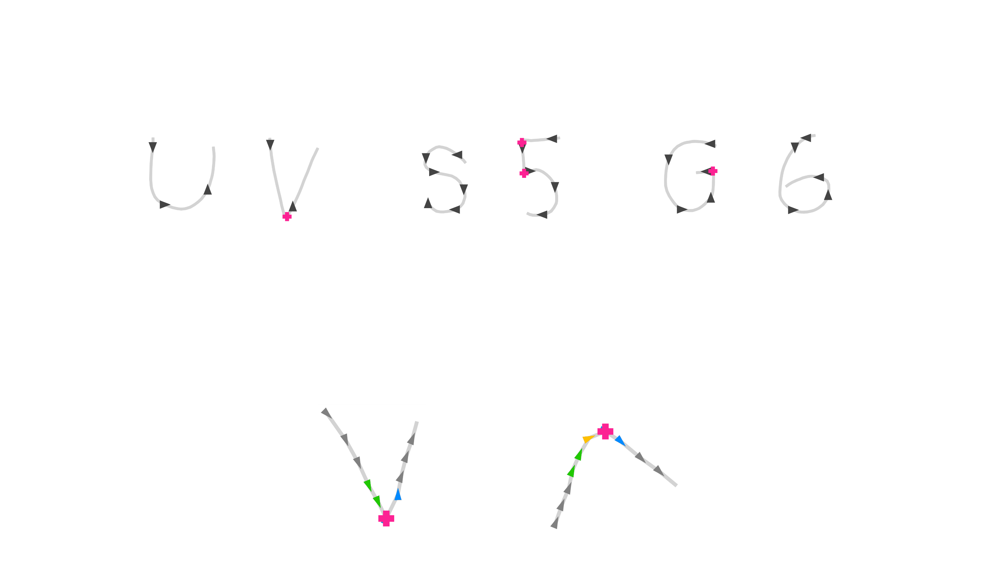

slidenumbers: true


### **SQL is a Programming Language, Summer 2018**<br><br>

# [fit] Handwriting Recognition
## with SQL (and a tiny bit of web stuff)

<br>
<br>
<br>

Noah Doersing

---
<!--
## Handwriting *sucks* and we want to translate it into a format that doesn't suck (e.g. a  database)
---
-->

## *A long time ago in a galaxy very, very close...*

In the early 60s, keyboard proficiency was less widespread, so other input methods were explored.

^ You know, before their time, really, because they had these massive CRT screens etc., no iPad.

^ alan kay, pioneered object-oriented programming and window-based GUIs at Xerox PARC

  Alan Kay, "Doing with Images Makes Symbols" (1987):[^1]
     **"None of us can type, can you do something about that?"**

[^1]: `http://archive.org/details/AlanKeyD1987?start=1439.5`

---

^ wonder how he felt the first time he used an ipad


---

[Instead of implementing an entire interface paradigm, only consider *core problem*: **Recognition of a single-stroke character.**]()

[Slight modifications to some characters to make this work.]()


---

^ The RAND tablet was $18K, which is slightly above my pay grade

^ origin in bottom left, not top left as is standard in computer graphics


Simple D3.js-based web version, connected
to a PostgreSQL instance running on my
server. **Try it on your phones:**

<br>

## `hejnoah.com/handwriting/`

---

It yields a JSON-encoded *time series of coordinate pairs*. In order to transfer this into a  database...

**1.** Define variable `pen` via command-line parameter.

```bash
psql -v pen='[{"x":1, "y":3},{"x":3, "y":7}]' -f handwriting.sql                
```

**2.** Convert JSON array into tabular representation.

```sql
WITH RECURSIVE
tablet(pos, x, y) AS (
  SELECT ordinality AS pos, x, y
  FROM   ROWS FROM(jsonb_to_recordset(:'pen') AS (x int, y int)) WITH ORDINALITY
), ...
```

---

^ MEMO & ESSAY => visualizations


## Approach[^2]

1. Smoothing & thinning of stroke
2. Curvature & corner detection
3. Extraction of additional features
4. Descending a hardcoded *decision
   tree* mapping features to characters

[^2]: `https://www.rand.org/pubs/research_memoranda/RM5016.html`, `http://jackschaedler.github.io/handwriting-recognition/`

---

^ here: just average
^ see around 1.0: right angle. bad!
^ shortens the stroke in both x and y => choose weight/smoothingfactor wisely

[**Smoothing:** Removes *quantization noise*. Compute weighted average of most recently smoothed point and incoming point.]()


---

^ some typecasts to make the types play nicely (rather: avoid increases in precision due to recursion and `numeric`)

```sql, [.highlight: 2-4]
smooth(pos, x, y) AS (
  SELECT pos, x :: real, y :: real
  FROM   tablet
  WHERE  pos = 1

    UNION ALL

  SELECT t.pos,
         (:smoothingfactor * s.x + (1.0 - :smoothingfactor) * t.x) :: real AS x,
         (:smoothingfactor * s.y + (1.0 - :smoothingfactor) * t.y) :: real AS y
  FROM   smooth s, tablet t
  WHERE  t.pos = s.pos + 1
),
```

Variable `smoothingfactor` must be set before running the query. Sensible values: between `0.5` and `0.8`.

---


```sql, [.highlight: 8-12]
smooth(pos, x, y) AS (
  SELECT pos, x :: real, y :: real
  FROM   tablet
  WHERE  pos = 1

    UNION ALL

  SELECT t.pos,
         (:smoothingfactor * s.x + (1.0 - :smoothingfactor) * t.x) :: real AS x,
         (:smoothingfactor * s.y + (1.0 - :smoothingfactor) * t.y) :: real AS y
  FROM   smooth s, tablet t
  WHERE  t.pos = s.pos + 1
),
```

Variable `smoothingfactor` must be set before running the query. Sensible values: between `0.5` and `0.8`.

---

```sql
smooth(pos, x, y) AS (
  SELECT pos, x :: real, y :: real
  FROM   tablet
  WHERE  pos = 1

    UNION ALL

  SELECT t.pos,
         (:smoothingfactor * s.x + (1.0 - :smoothingfactor) * t.x) :: real AS x,
         (:smoothingfactor * s.y + (1.0 - :smoothingfactor) * t.y) :: real AS y
  FROM   smooth s, tablet t
  WHERE  t.pos = s.pos + 1
),
```

Variable `smoothingfactor` must be set before running the query. Sensible values: between `0.5` and `0.8`.

---

[**Thinning:** Eases further *processing requirements*. Reject points within a certain distance from the most recent accepted point.]()


---

^ pick the first smoothed coord pair after the most recently accepted thinned point for which sqrt(...) holds

```sql, [.highlight: 11-15]
thin(pos, x, y) AS (
  SELECT *
  FROM   smooth
  WHERE  pos = 1

    UNION ALL

  SELECT *
  FROM   (
    SELECT s.pos, s.x, s.y
    FROM   thin t, smooth s
    WHERE  s.pos > t.pos
    AND    :thinningsize < |/ (s.x - t.x)^2 + (s.y - t.y)^2                     
    ORDER BY s.pos
    LIMIT 1
  ) AS _
),
```

---

^ because `ORDER BY` is illegal in recursive part

```sql, [.highlight: 8,9,16]
thin(pos, x, y) AS (
  SELECT *
  FROM   smooth
  WHERE  pos = 1

    UNION ALL

  SELECT *
  FROM   (
    SELECT s.pos, s.x, s.y
    FROM   thin t, smooth s
    WHERE  s.pos > t.pos
    AND    :thinningsize < |/ (s.x - t.x)^2 + (s.y - t.y)^2                     
    ORDER BY s.pos
    LIMIT 1
  ) AS _
),
```

---

```sql
thin(pos, x, y) AS (
  SELECT *
  FROM   smooth
  WHERE  pos = 1

    UNION ALL

  SELECT *
  FROM   (
    SELECT s.pos, s.x, s.y
    FROM   thin t, smooth s
    WHERE  s.pos > t.pos
    AND    :thinningsize < |/ (s.x - t.x)^2 + (s.y - t.y)^2                     
    ORDER BY s.pos
    LIMIT 1
  ) AS _
),
```

---

^ division into four zones done by rounding `angle/90

[**Curvature detection:** Compute *cardinal directions* ▲▼◀▶ of line segments between point pairs. Discard sequential duplicates.]()

<br>

[Originally done using a set of]()
[*inequalities*, but *trigonometry* is]()
[more elegant and reasonably]()
[fast on modern hardware.]()

[Recall: $$tangent = \frac{opposite\,\,leg}{adjacent\,\,leg}$$]()


---

**1.** Compute angle between every pair of thinned points using window function `lag()`:

```sql
curve(pos, x, y, direction) AS (
  SELECT pos, x, y,
         degrees(-atan2( y - lag(y) OVER (ORDER BY pos),               
                        -x + lag(x) OVER (ORDER BY pos))) + 180
  FROM   thin
),
```

---

^ exploit **rounding behavior** of `int` cast

^ `% 4` because of that

**2.** Define appropriate `ENUM` type with fancy Unicode triangles:

```sql
CREATE TYPE cardinal_direction AS ENUM('▶', '▲', '◀', '▼');                     
```

**3.** Use `enum_range()` function (returns the values of its argument's `ENUM` type as an array) to convert `angle / 90` into arrow symbols.

```sql
cardinal(pos, direction) AS (
  SELECT pos,
         (enum_range(NULL :: cardinal_direction))[(direction / 90) :: int % 4
                                                                          + 1]  
  FROM   curve
),
```

---

^ `COALESCE` instead of "() IS NULL OR..." because code duplication avoidance

**4.** Only keep changes of the cardinal direction, i.e. a *new* direction that, additionally, occurs at least *twice in succession*.

```sql
cardinal_change(pos, direction) AS (
  SELECT pos, direction
  FROM   cardinal
  WHERE  COALESCE(lag(direction, 2) OVER win <> lag(direction) OVER win,        
                  true)  -- Prevent NULLs from escaping this term.
  AND    lag(direction) OVER win = direction
  WINDOW win AS (ORDER BY pos)
),
```

---

^ Window functions are permitted only in the SELECT list and the ORDER BY clause of the query. They are forbidden elsewhere, such as in GROUP BY, HAVING and WHERE clauses. This is because they logically execute after the processing of those clauses.

...except this doesn't work because window functions cannot be used in `WHERE` clauses. Resort to an awkward subquery.

```sql
cardinal_change(pos, direction) AS (
  SELECT pos, direction
  FROM   (SELECT pos, direction,
                 COALESCE(lag(direction, 2) OVER win <> lag(direction) OVER win,
                          true)  -- Prevent NULLs from escaping this term.
                 AND lag(direction) OVER win = direction
          FROM cardinal
          WINDOW win AS (ORDER BY pos)) AS _(pos, direction, is_new)
  WHERE  is_new
),
```

---


[**Corner detection:** Allows discerning between *similar characters*.]()



<br>
<br>
<br>

[Corners lie between two line segments going in the *same direction* and two segments going in a *wildly different direction*, with an optional in-between "turn" segment.]()


---

^ multiple ways of doing this. search on stack overflow for the wildest stuff.

**1.** Define function that computes angle difference (trivial for angle pairs like 10° and 20°, but less so for 350° and 30°).

```sql
CREATE OR REPLACE FUNCTION angdiff(alpha double precision,
                                   beta double precision) RETURNS real AS $$    
  SELECT abs(degrees(atan2(sin(radians(alpha - beta)),
                           cos(radians(alpha - beta))))) :: real;
  --SELECT (180 - abs(abs(alpha - beta) - 180)) :: real;
$$ LANGUAGE SQL IMMUTABLE;
```

---

**2.** Detect corners with the help of another awkward subquery.

```sql
corner(pos, x, y) AS (
  SELECT pos, x, y
  FROM   (SELECT pos, x, y, (
                   angdiff(lag(direction, 2) OVER win, lag(direction) OVER win) < 22.5
                   AND angdiff(lag(direction) OVER win, direction) > :cornerangle
                   AND angdiff(direction, lead(direction) OVER win) < 22.5
                 ) OR (  -- Immediate direction change OR one-segment turn.
                   angdiff(lag(direction, 3) OVER win, lag(direction, 2) OVER win) < 22.5
                   AND angdiff(lag(direction, 2) OVER win, direction) > :cornerangle
                   AND angdiff(direction, lead(direction) OVER win) < 22.5
                 ) AS is_corner
          FROM   curve
          WINDOW win AS (ORDER BY pos)) AS _(pos, x, y, is_corner)
  WHERE  is_corner
),
```

---

**2.** Detect corners with the help of another awkward subquery.

```sql, [.highlight: 12]
corner(pos, x, y) AS (
  SELECT pos, x, y
  FROM   (SELECT pos, x, y, (
                   angdiff(lag(direction, 2) OVER win, lag(direction) OVER win) < 22.5
                   AND angdiff(lag(direction) OVER win, direction) > :cornerangle
                   AND angdiff(direction, lead(direction) OVER win) < 22.5
                 ) OR (  -- Immediate direction change OR one-segment turn.
                   angdiff(lag(direction, 3) OVER win, lag(direction, 2) OVER win) < 22.5
                   AND angdiff(lag(direction, 2) OVER win, direction) > :cornerangle
                   AND angdiff(direction, lead(direction) OVER win) < 22.5
                 ) AS is_corner
          FROM   curve
          WINDOW win AS (ORDER BY pos)) AS _(pos, x, y, is_corner)
  WHERE  is_corner
),
```

---

**2.** Detect corners with the help of another awkward subquery.

```sql, [.highlight: 4-6]
corner(pos, x, y) AS (
  SELECT pos, x, y
  FROM   (SELECT pos, x, y, (
                   angdiff(lag(direction, 2) OVER win, lag(direction) OVER win) < 22.5
                   AND angdiff(lag(direction) OVER win, direction) > :cornerangle
                   AND angdiff(direction, lead(direction) OVER win) < 22.5
                 ) OR (  -- Immediate direction change OR one-segment turn.
                   angdiff(lag(direction, 3) OVER win, lag(direction, 2) OVER win) < 22.5
                   AND angdiff(lag(direction, 2) OVER win, direction) > :cornerangle
                   AND angdiff(direction, lead(direction) OVER win) < 22.5
                 ) AS is_corner
          FROM   curve
          WINDOW win AS (ORDER BY pos)) AS _(pos, x, y, is_corner)
  WHERE  is_corner
),
```

---

**2.** Detect corners with the help of another awkward subquery.

```sql, [.highlight: 8-10]
corner(pos, x, y) AS (
  SELECT pos, x, y
  FROM   (SELECT pos, x, y, (
                   angdiff(lag(direction, 2) OVER win, lag(direction) OVER win) < 22.5
                   AND angdiff(lag(direction) OVER win, direction) > :cornerangle
                   AND angdiff(direction, lead(direction) OVER win) < 22.5
                 ) OR (  -- Immediate direction change OR one-segment turn.
                   angdiff(lag(direction, 3) OVER win, lag(direction, 2) OVER win) < 22.5
                   AND angdiff(lag(direction, 2) OVER win, direction) > :cornerangle
                   AND angdiff(direction, lead(direction) OVER win) < 22.5
                 ) AS is_corner
          FROM   curve
          WINDOW win AS (ORDER BY pos)) AS _(pos, x, y, is_corner)
  WHERE  is_corner
),
```

---

^ O: start = end

^ 1/7: aspect ratio

[**Feature extraction:** Extract some *supplementary features* that will help discern between different characters later on: Start point, end point, aspect ratio, ...]()

[Transform from absolute pixel positions to 4x4 grid segments.]()


---

**1.** Define *axis-aligned bounding box* around pen stroke and gather some statistics.

```sql
aabb(xmin, xmax, ymin, ymax, aspect, width, height, centerx, centery) AS (
  SELECT min(x),
         max(x),
         min(y),
         max(y),
         (max(y) - min(y)) / greatest(1, (max(x) - min(x))),  -- Prevent n/0.   
         max(x) - min(x),
         max(y) - min(y),
         min(x) + (max(x) - min(x)) / 2,
         min(y) + (max(y) - min(y)) / 2
  FROM   smooth
),
```

---

**2.** Define function for *transforming* coordinates of start, end and corners into grid positions.

```sql
CREATE OR REPLACE FUNCTION gridpos(width real, height real,
                                   xmin real, ymin real,
                                   x real, y real) RETURNS int AS $$
  SELECT greatest(0,
                  15 - (      (floor(4 * (x - xmin) / (width  + 1)) :: int)
                        + 4 * (floor(4 * (y - ymin) / (height + 1)) :: int)));
$$ LANGUAGE SQL IMMUTABLE;
```

**3.** Apply this function and thus create CTEs `start_grid`, `stop_grid` and `corner_grid`. Not shown.

---

**4.** Accumulate extracted features. This single-row table contains **all information required to identify the drawn character**.

```sql
features(directions, start, stop, corners, width, height, aspect, center) AS (
  SELECT (SELECT array_agg(direction ORDER BY pos)
          FROM   cardinal_change),
         (TABLE start_grid),
         (TABLE stop_grid),
         (SELECT COALESCE(array_agg(n ORDER BY pos), '{}')
          FROM   corner_grid),
         width,
         height,
         aspect,
         point(centerx, centery)
  FROM   aabb
),
```

---

```
┌────────────┬───────┬──────┬─────────┬─────────┬─────────┬────────┬───────────────────┐
│ directions │ start │ stop │ corners │  width  │ height  │ aspect │      center       │
├────────────┼───────┼──────┼─────────┼─────────┼─────────┼────────┼───────────────────┤
│ {▲,▼,◀}    │    15 │   11 │ {1,12}  │ 36.7595 │ 66.1965 │ 1.8008 │ (55.3797,64.0982) │
└────────────┴───────┴──────┴─────────┴─────────┴─────────┴────────┴───────────────────┘
```


---


**Decision tree:** Depending on the first four cardinal directions, descend custom-tailored subtree.

Incredibly *awkward* in SQL.
Imagine 1000+ lines of deeply nested and probably buggy `CASE WHEN`s.

---

A better approach is to do this in *two discrete stages*:

1. Determine **candidate characters** based on the pen stroke's *first four cardinal directions*.
2. Settle on **best fit** by matching *selected stroke features*.

Less flexible than the procedure presented in the original memo, but significantly more *idiomatic* and concise.

^ point out: focus was on **feature extraction**, not mapping to characters because that's boring

^ there are **more relational approaches**: **direct** mapping (easily trainable!) or benjamin's approach (_**flattening first lookup table's second column**_, with appropriate query changes)

^ SQL turing-complete => go nuts

---

**1.** Determine initial set of potential characters.

```sql
CREATE TABLE lookup_candidates (
  first_four_directions cardinal_direction[],                                   
  candidate_characters  char[]
);
INSERT INTO lookup_candidates VALUES
  ('{"▼"}',             '{"I"}'),
  ('{"▼","◀"}',         '{"J"}'),
  ('{"▼","◀","▲"}',     '{"O","J","X","U"}'),
  ('{"▼","◀","▲","▶"}', '{"X","O","U"}'),
  ('{"▼","◀","▶","▲"}', '{"X"}'),
  ('{"▼","▶"}',         '{"L"}'),
  ('{"▼","▶","◀"}',     '{"6"}'),
  ('{"▼","▶","◀","▼"}', '{"4"}'),
  ('{"▼","▶","▲"}',     '{"O","U"}'),
  ...
```

---

**2.** Find best fit by feature matching. Read `NULL`s as "don't care".

```sql
CREATE TABLE lookup_bestfit (
  candidate_characters char[],
  character            char,
  start                int,
  stop                 int,
  corners              int[],
  aspect_range         numrange
);
INSERT INTO lookup_bestfit  -- All single-character patterns from first lookup. 
  ...
INSERT INTO lookup_bestfit VALUES
  ('{"M","N"}', 'M', NULL, 12, NULL, NULL),  -- End point bottom right.
  ('{"M","N"}', 'N', NULL, 0,  NULL, NULL),  -- End point top right.
  ...
```

---

**3.** Tie it all together: Consult *both* lookup tables in order.

```sql
character(character) AS (
  SELECT l.character
  FROM   features f, lookup_candidates c, lookup_bestfit l
  WHERE  f.directions[1:4] = c.first_four_directions
  AND    c.candidate_characters = l.candidate_characters
  AND    (l.start IS NULL          OR f.start = l.start)
  AND    (l.stop IS NULL           OR f.stop = l.stop)
  AND    (l.corners IS NULL        OR f.corners = l.corners)
  AND    (l.aspect_range IS NULL   OR l.aspect_range @> f.aspect :: numeric)    
),
```

---

**3.** Tie it all together: Consult *both* lookup tables in order.

```sql, [.highlight: 4]
character(character) AS (
  SELECT l.character
  FROM   features f, lookup_candidates c, lookup_bestfit l
  WHERE  f.directions[1:4] = c.first_four_directions
  AND    c.candidate_characters = l.candidate_characters
  AND    (l.start IS NULL          OR f.start = l.start)
  AND    (l.stop IS NULL           OR f.stop = l.stop)
  AND    (l.corners IS NULL        OR f.corners = l.corners)
  AND    (l.aspect_range IS NULL   OR l.aspect_range @> f.aspect :: numeric)    
),
```

^ extract first four directions of stroke and perform first lookup

---

**3.** Tie it all together: Consult *both* lookup tables in order.

```sql, [.highlight: 5]
character(character) AS (
  SELECT l.character
  FROM   features f, lookup_candidates c, lookup_bestfit l
  WHERE  f.directions[1:4] = c.first_four_directions
  AND    c.candidate_characters = l.candidate_characters
  AND    (l.start IS NULL          OR f.start = l.start)
  AND    (l.stop IS NULL           OR f.stop = l.stop)
  AND    (l.corners IS NULL        OR f.corners = l.corners)
  AND    (l.aspect_range IS NULL   OR l.aspect_range @> f.aspect :: numeric)    
),
```

^ based on first lookup result, perform lookup in the second table

---

**3.** Tie it all together: Consult *both* lookup tables in order.

```sql, [.highlight: 6-9]
character(character) AS (
  SELECT l.character
  FROM   features f, lookup_candidates c, lookup_bestfit l
  WHERE  f.directions[1:4] = c.first_four_directions
  AND    c.candidate_characters = l.candidate_characters
  AND    (l.start IS NULL          OR f.start = l.start)
  AND    (l.stop IS NULL           OR f.stop = l.stop)
  AND    (l.corners IS NULL        OR f.corners = l.corners)
  AND    (l.aspect_range IS NULL   OR l.aspect_range @> f.aspect :: numeric)    
),
```

^ match features

---

**3.** Tie it all together: Consult *both* lookup tables in order.

```sql, [.highlight: 2]
character(character) AS (
  SELECT l.character
  FROM   features f, lookup_candidates c, lookup_bestfit l
  WHERE  f.directions[1:4] = c.first_four_directions
  AND    c.candidate_characters = l.candidate_characters
  AND    (l.start IS NULL          OR f.start = l.start)
  AND    (l.stop IS NULL           OR f.stop = l.stop)
  AND    (l.corners IS NULL        OR f.corners = l.corners)
  AND    (l.aspect_range IS NULL   OR l.aspect_range @> f.aspect :: numeric)    
),
```

^ And we're done! 🎊🎉

---

^ no single operation that takes the vast majority of time => reasonably evenly split

**Performance:** Most algorithms designed in the 60's will run on modern hardware *just fine* – this one is no exception:

The whole chain of queries terminates after **~15 ms**.

**SQL is, *after all*, a programming language.**


---

^ cmd+F1

<br>
<br>

#[fit] *       Demo       *

<br>

**Handwriting Recognition with SQL**
Noah Doersing


